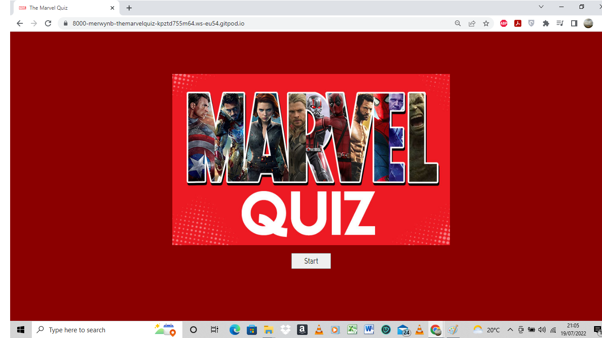

# The Marvel Quiz

The Marvel Quiz is a quick 6 questions quiz game based on the Marvel movies. The target audience for this game are kids and adults who are Marvel movie enthusiasts who can test their knowledge about the Marvel universe. This quiz is compatible for desktop, laptop, tablet and mobile devices

## Features

__Start Screen__

I have created a start quiz screen which displays a Marvel image banner so that it looks attractive to the user. I have also included a Start Quiz button, clicking on this button hides the banner and the start quiz button and displays the game screen which were all hidden in the Start Screen.

__The Marvel Quiz Game Screen__

The Marvel Quiz Game Screen comprises of The Marvel logo followed by the title of the game "The Marvel Quiz", the score area, the question and choices area and finally the Next button.

__The Score Area__

The Score area displays the current score of the user. When the user clicks on the choice labels the score increments by 10 points on every correct answer which goes upto a maximum of 60 points. On restarting the game the score clears back to 0.

__The Game Area__

The Game Area is comprised of 2 aspects:
1) The Question - This displays a question from the Marvel Quiz which is chosen on random by the computer from the 6 questions and displays a new question everytime the Next button is clicked.
2) The Choices - This displays 4 choices for the user to choose from. The choices are specific to the question displayed on the screen and returns 1 correct answer. The choices are interactive as when a user hovers the pointer over them it highlights the current choice label and when clicked it will lock the choice and disable the other choices which is displayed with gray text.

__The Next Button__

The Next button is placed in the center below the choices. On clicking this button the computer checks the user's input and then if the input is correct it increments the score by 10 points and if incorrect it remains the same. This button then displays the next random question maintaining the aspects of the game screen. 

__The Restart Button__

The Restart button is displayed only on the last random question of the quiz. When the user clicks on this button, the game is reset to the first random question and the score is also cleared to 0 which allows the user to play the quiz again!.

## Future Features

In the future I would like to add an End Game screen which saves the score and allows the user to enter and save their name so they can compete with other players playing The Marvel Quiz on the web. I would also like to update and add more questions and Levels to the Quiz to choose difficulty level.

## Testing

I have tested the website on different platforms like Google Chrome and Firefox which works fine. 
I have manually tested all the buttons and labels with correct and incorrect inputs within the website to be working as expected. 

### Validator Testing

I have run all my html pages in the official W3C Validator and no erros returned.
Ihave also run my CSS file in the official Jigsaw Validator and no errors returned.

### Lighthouse Testing

I have tested my website on the Lighthouse feature in the Google Chrome Dev tools and I am happy to say that my site has a sore of 99 in Performance, 100 in Accessibility, 92 in Best Practices and 90 in SEO for desktop and a sore of 92 in Performance, 100 in Accessibility, 92 in Best Practices and 83 in SEO for mobile-device.

### Bugs

The W3C Validator was showing an error in my index.html file as an unexpected ending 
 tag which i had used to enclose the choices container. I rectified it by deleting the tag. 

## Deployment

The site was deployed to GitHub pages. The steps to deploy are as follows: 
1) In the GitHub repository, navigate to the Settings tab 
2) From the source section drop-down menu, select the Master Branch
3) Once the master branch has been selected, the page will be automatically refreshed with a detailed   ribbon display to indicate the successful deployment. 

This is the live link: 

## Credits

1) The interactive choices to highlight is inspired from the How to make Tea coding challenge by the Code Institute which i had undergone before I started with this course.
2) I have researched on the website of W3 Schools www.w3schools.com to findout how I can go about with Javascript which was very helpful.

### Special Thanks to:
My wife Jerilee who helped me make choices with the color schemes to use. Last but not the Least a Big Thank you to my friend Sunny Kumar who guided me with the concepts of Javascript as there were times when i was so stuck with my javascript code and I was then able to attain the result that I was looking for. There was also a time when I had almost finished my code and due to my negligence I had not commited and pushed my code and I accidently closed my Gitpod tab and lost 1/4th of my code. Sunny helped me to retrive this code as i luckily had the latest version of my quiz opened in the web browser, he then recovered the lost code through dev tools.